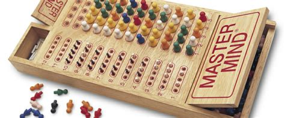
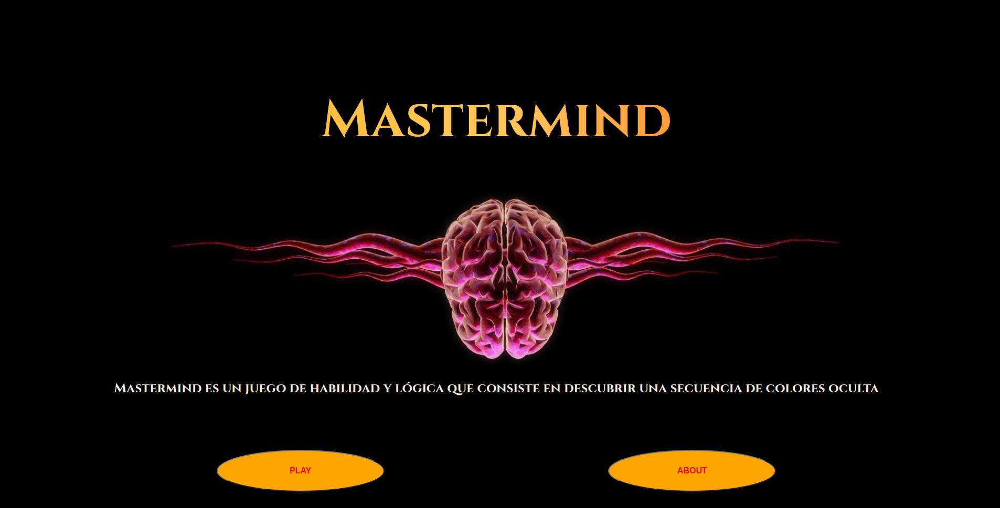
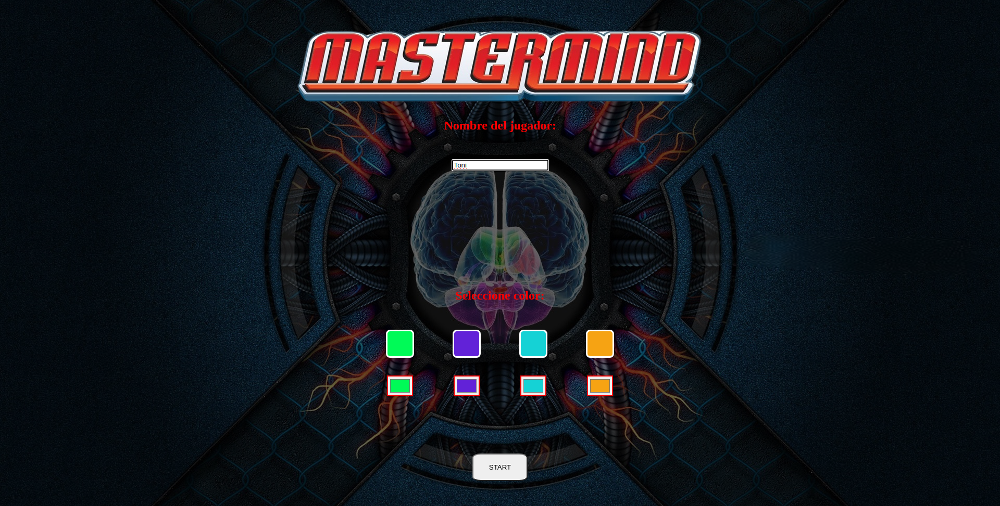
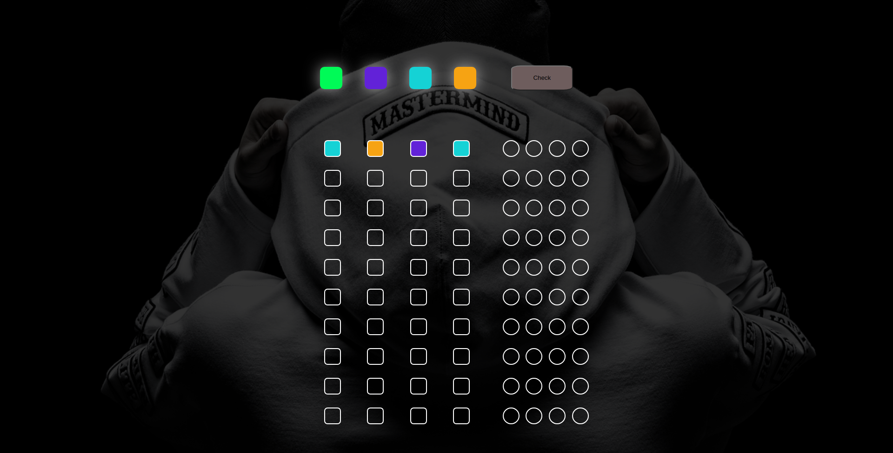

<h1 align="center"># README - MasterMind</h1>

_______________________________________________

Este proyecto se basa en el clásico juego de mesa MasterMind y aqui se presenta una versión interactiva del mismo

   

      
   

   

## INDICE

- [Contenido](#📋-contenido)
- [Funcionamiento](#⚙-funcionamiento)
- [Tecnologías utilizadas](#🔧-tecnologías-utilizadas)
- [Autor](#🔖-autor)
- [Licencia](#⚖️-licencia)

   

## 📋 Contenido

Se compone de:

1. **index**: Página principal de bienvenida que ofrece una breve descripción del juego y su temática.

   

      
   
 

2. **about**: Donde encontramos las instrucciones del juego y sus reglas, para entender su funcionamiento.

   

      
   
 

3. **choice**: Aquí, el jugador ingresará su nombre y seleccionará cuatro colores diferentes.

   

      
   
  

4. **play**: Donde empezaremos el juego y pondremos en funcionamiento nuestra logica.

   

      
   
  

5. **winner**: Al resolver la combinación ganadora, serás redirigido a esta página, desde donde podrás reiniciar el juego y volver a la página de bienvenida.

   

      
   
  

6. **loser**: Llegaremos a esta pagina en caso de no haber resuelto la combinación ganadora antes de diez intentos, en la que podremos volver a jugar otra partida desde el principio con un nuevo tablero.

   

      
   

  

## ⚙ Funcionamiento

El usuario comenzará en la página de bienvenida, en la cual puede dirigirse a la sección "ABOUT" para ver las instrucciones de funcionamiento y las reglas del juego, o directamente puede hacer clic en "PLAY" y luego se le pedirá que introduzca su nombre y elija cuatro colores diferentes.

Una vez introducido todo lo anterior, ya podrá empezar a realizar combinaciones con los colores que seleccionó anteriormente. Una vez rellenada toda la fila, el usuario dará clic en el botón "CHECK" para realizar la comprobación y, si no ha acertado la combinación, pasará a la siguiente fila.

A la hora de realizar la combinación ganadora, la máquina puede, o no, repetir algún color para dotar de complejidad a la combinación (uno, dos o tres colores, nunca repetira los cuatro colores).

Cada vez que el usuario desé comprobar su conbinación, se le dara unas pistas. Las cuales son, si el color esta en su posición correcta se le indicara en color verde y si el color seleccionado no esta en su posición correcta, pero si en la combinación ganadora, se le indicara en color ambar.

Si el usuario logra dar con la combinación ganadora antes de diez intentos, habrá ganado y, si desea volver a jugar, deberá reiniciar el juego para introducir de nuevo todos los datos que se le solicitan. En cambio, si pierde, puede volver a jugar otra partida y no se le pedirá que vuelva a introducir ni su nombre ni seleccionar los colores, ya que la máquina generará una nueva combinación ganadora.

## 🔧 Tecnologías Utilizadas

## 🔖 Autor

Antonio Insa Benavent
https://www.linkedin.com/antonioinsa

## ⚖️ Licencia

Proyecto bajo licencia MIT.

Consulta el archivo <a href="./LICENSE">`LICENSE`</a> para más información.